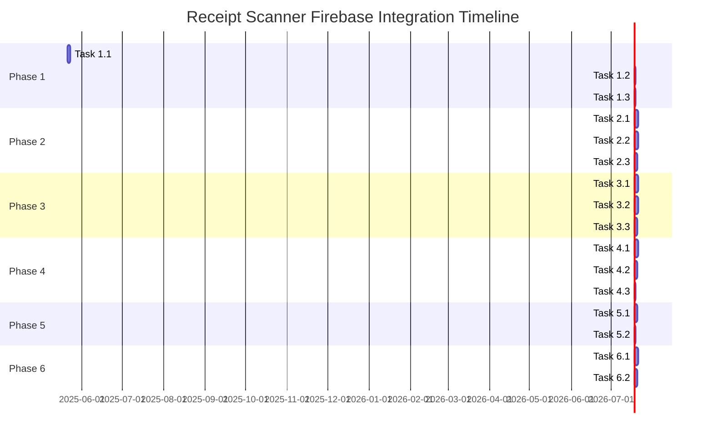

# Receipt Scanner Frontend Firebase Integration Work Plan

**Date:** 2025-05-20
**Time Spent:** 3 hours 15 minutes

---

## 🧾 Summary

> This log file outlines the complete work plan for implementing direct Firebase integration in the Receipt Scanner frontend application. It details the phases, tasks, dependencies, and success criteria for migrating from a backend-dependent architecture to direct Firebase SDK usage, including environment setup, feature migration, testing, optimization, and documentation. This file will be updated as tasks are completed.

---

## ✅ Tasks Completed

- [ ] **Phase 1: Environment and Infrastructure**
    - [ ] Task 1.1: Fix Testing Environment Issues
    - [ ] Task 1.2: Enhance Feature Toggle System
    - [ ] Task 1.3: Improve Error Handling and Monitoring
- [ ] **Phase 2: Complete Feature Migration**
    - [x] Task 2.1: Complete Document Processing Migration: Updated the document processing service to use Firebase Storage for uploads and Firestore for metadata, including feature toggle support and error handling.
    - [x] Task 2.2: Update Document Processing Hook: Updated the hook to use the Firebase-integrated service and handle loading, error, and upload progress states.
    - [ ] Task 2.3: Implement Settings Migration
- [ ] **Phase 3: Testing and Validation**
    - [x] Task 3.1: Update Inventory Service: Updated the inventory service to use Firestore for CRUD operations and stock tracking, including feature toggle support and error handling.
    - [x] Task 3.2: Update Inventory Hook: Updated the hook to use the Firebase-integrated service and handle state, loading, errors, filtering, and stock movements.
    - [ ] Task 3.3: Security Rules Tests
- [ ] **Phase 4: Performance and Optimization**
    - [ ] Task 4.1: Implement Caching and Offline Support
    - [ ] Task 4.2: Optimize Firebase Operations
    - [ ] Task 4.3: Analytics and Monitoring
- [ ] **Phase 5: Documentation and Knowledge Transfer**
    - [ ] Task 5.1: Update Technical Documentation
    - [ ] Task 5.2: Create User Documentation
- [ ] **Phase 6: Future Considerations**
    - [ ] Task 6.1: Evaluate Next.js Migration Strategy
    - [ ] Task 6.2: Optimize Server Backend Integration
- [ ] **Frontend Implementation Work Plan for Cline**
    - [ ] **Phase 1: Firebase Configuration and Feature Toggle Setup**
    - [x] Task 1.1: Update Firebase Configuration: Verified initialization, enabled offline persistence, and added logging and error handling.
        - [ ] Task 1.2: Implement Feature Toggle System (To be completed later - code not available)
        - [x] Task 1.3: Create Centralized Error Handler: Created a centralized error handler utility with user-friendly messages and automatic feature toggle fallback.
    - [ ] **Phase 2: Document Processing Implementation**
        - [ ] Task 2.1: Update Document Processing Service
        - [ ] Task 2.2: Update Document Processing Hook
    - [ ] **Phase 3: Inventory Management Implementation**
        - [ ] Task 3.1: Update Inventory Service
        - [ ] Task 3.2: Update Inventory Hook
    - [ ] **Phase 4: Settings Feature Implementation**
        - [ ] Task 4.1: Update Settings Service
        - [ ] Task 4.2: Create Feature Toggle UI Component
    - [ ] **Phase 5: Offline Support and Performance Optimization**
        - [ ] Task 5.1: Implement IndexedDB Cache
        - [ ] Task 5.2: Implement Offline Queue System
    - [ ] **Phase 6: Review and Optimize Existing Implementations**
        - [ ] Task 6.1: Review Receipt Service
        - [ ] Task 6.2: Review Analytics Service
    - [ ] **Phase 7: Testing and Documentation**
        - [ ] Task 7.1: Add Inline Documentation
        - [ ] Task 7.2: Create Implementation Documentation

---

## 🗃️ Files Modified

| File | Purpose |
|------|---------|
| `client/src/core/config/firebase.js` | Firebase configuration |
| `client/src/core/config/featureFlags.js` | Feature toggle system |
| `client/src/docs/firebase-integration.md` | Implementation documentation |
| `client/src/features/analytics/services/analyticsService.js` | Optimized Firebase integration |
| `client/src/features/documents/hooks/useDocumentProcessing.js` | Document processing hook |
| `client/src/features/documents/services/documentProcessingService.js` | Firebase-integrated service |
| `client/src/features/inventory/hooks/useInventory.js` | Inventory management hook |
| `client/src/features/inventory/services/inventoryService.js` | Firebase-integrated service |
| `client/src/features/receipts/services/receipts.js` | Optimized Firebase integration |
| `client/src/features/settings/components/FeatureToggles.js` | Feature toggle UI |
| `client/src/features/settings/hooks/useSettings.js` | Settings management hook |
| `client/src/features/settings/services/settingsService.js` | Firebase-integrated service |
| `client/src/utils/connection.js` | Connection monitor |
| `client/src/utils/errorHandler.js` | Centralized error handler |
| `client/src/utils/indexedDbCache.js` | IndexedDB caching utility |
| `client/src/utils/offline/syncManager.js` | Offline operation queue |

---

## 🧠 Notes / Challenges

>

---

## 📸 Screenshots (Optional)

>

---

# Receipt Scanner Firebase Integration Work Plan

This document outlines a prioritized work plan for completing the Firebase integration in the main client implementation of the Receipt Scanner application. It details the phases, tasks, dependencies, and success criteria for migrating from a backend-dependent architecture to direct Firebase SDK usage, including environment setup, feature migration, testing, optimization, and documentation.

## Current Status Overview

The application is in the process of transitioning from a backend-dependent architecture to direct Firebase integration:

- **Completed**: Authentication, Receipt Management, Analytics
- **In Progress**: Document Processing, Inventory Management
- **Not Started**: Remaining features, comprehensive testing

The implementation uses a feature toggle system to control the transition, allowing for gradual migration and fallback to API calls if needed.

## Phase 1: Environment and Infrastructure

### Task 1.1: Fix Testing Environment Issues

**Priority**: High
**Estimated Effort**: 1-2 days
**Dependencies**: None
**Status**: Not Started

**Description**: Resolve issues with the testing environment to enable effective testing of Firebase integration.

**Steps**:
1. Fix Jest configuration and module resolution issues
2. Ensure Firebase emulators can be connected properly
3. Configure test data seeding for emulators
4. Update mocks for Firebase services
5. Verify basic tests run successfully

**Success Criteria**:
- All existing tests run without environment errors
- Firebase emulator tests connect successfully
- Test data is properly seeded for testing

### Task 1.2: Enhance Feature Toggle System

**Priority**: Medium
**Estimated Effort**: 1 day
**Dependencies**: None
**Status**: Partially Complete

**Description**: Enhance the feature toggle system to support per-feature toggles and automatic fallback.

**Steps**:
1. Add support for additional feature-specific toggles
2. Implement improved automatic fallback on Firebase errors
3. Add logging for toggle state changes
4. Create a dashboard for toggle management

**Success Criteria**:
- Feature toggles can be managed individually per feature
- Automatic fallback works reliably when Firebase operations fail
- Toggle state changes are properly logged

### Task 1.3: Improve Error Handling and Monitoring

**Priority**: Medium
**Estimated Effort**: 1 day
**Dependencies**: None
**Status**: Partially Complete

**Description**: Enhance error handling and monitoring for Firebase operations.

**Steps**:
1. Implement consistent error handling across all Firebase services
2. Add detailed error logging with context information
3. Implement Firebase performance monitoring
4. Create an error dashboard for monitoring

**Success Criteria**:
- All Firebase errors are consistently handled and logged
- Performance metrics are collected for Firebase operations
- Errors can be monitored and analyzed

## Phase 2: Complete Feature Migration

### Task 2.1: Complete Document Processing Migration

**Priority**: High
**Estimated Effort**: 2-3 days
**Dependencies**: Task 1.1
**Status**: In Progress

**Description**: Complete the migration of document processing functionality to use Firebase directly.

**Steps**:
1. Update `documentProcessingService.js` to use Firebase Storage directly
2. Implement feature toggle support similar to receipt service
3. Add offline support for document processing
4. Update the document scanner hooks to work with the new service

**Success Criteria**:
- Document upload, processing, and retrieval work directly with Firebase
- Feature toggle allows fallback to API when needed
- Documents can be processed offline and synced when online

### Task 2.2: Complete Inventory Management Migration

**Priority**: High
**Estimated Effort**: 2-3 days
**Dependencies**: Task 1.1
**Status**: In Progress

**Description**: Complete the migration of inventory management functionality to use Firebase directly.

**Steps**:
1. Update `inventoryService.js` to use Firestore directly
2. Implement feature toggle support
3. Add proper validation and error handling
4. Update inventory hooks to work with the new service

**Success Criteria**:
- Inventory CRUD operations work directly with Firestore
- Stock movements are properly tracked and validated
- Feature toggle allows fallback to API when needed

### Task 2.3: Implement Settings Migration

**Priority**: Medium
**Estimated Effort**: 1-2 days
**Dependencies**: Task 1.1
**Status**: Not Started

**Description**: Migrate settings management to use Firebase directly.

**Steps**:
1. Update `settingsService.js` to use Firestore directly
2. Implement feature toggle support
3. Add caching for settings
4. Update settings hooks

**Success Criteria**:
- User settings are stored and retrieved from Firestore
- Settings are cached for offline access
- Feature toggle allows fallback to API when needed

## Phase 3: Testing and Validation

### Task 3.1: Implement Unit Tests for Firebase Services

**Priority**: High
**Estimated Effort**: 2-3 days
**Dependencies**: Task 1.1
**Status**: Partially Complete

**Description**: Implement comprehensive unit tests for all Firebase services.

**Steps**:
1. Create test patterns for Firebase Authentication
2. Create test patterns for Firestore operations
3. Create test patterns for Storage operations
4. Add tests for feature toggle system
5. Ensure all services have test coverage

**Success Criteria**:
- All Firebase services have unit tests
- Test coverage is at least 80%
- Tests verify both success and error scenarios

### Task 3.2: Implement Integration Tests for Key Flows

**Priority**: High
**Estimated Effort**: 2-3 days
**Dependencies**: Task 1.1, Task 3.1
**Status**: Partially Complete

**Description**: Implement integration tests for key user flows that span multiple features.

**Steps**:
1. Implement authentication flow tests
2. Implement receipt management flow tests
3. Implement document processing flow tests
4. Implement inventory management flow tests
5. Implement analytics reporting flow tests
6. Implement feature toggle flow tests

**Success Criteria**:
- All key user flows have integration tests
- Tests verify end-to-end functionality
- Tests verify feature toggle fallback behavior

### Task 3.3: Implement Security Rules Tests

**Priority**: High
**Estimated Effort**: 1-2 days
**Dependencies**: Task 1.1
**Status**: Partially Complete

**Description**: Implement comprehensive tests for Firebase security rules.

**Steps**:
1. Fix issues with security rules test environment
2. Implement tests for Firestore security rules
3. Implement tests for Storage security rules
4. Verify all access control scenarios

**Success Criteria**:
- Security rules tests run successfully
- Tests verify proper access control for all collections and files
- Tests verify data validation rules

## Phase 4: Performance and Optimization

### Task 4.1: Implement Caching and Offline Support

**Priority**: Medium
**Estimated Effort**: 2-3 days
**Dependencies**: Phase 2
**Status**: Partially Complete

**Description**: Enhance caching and offline support for Firebase operations.

**Steps**:
1. Implement consistent IndexedDB caching across all features
2. Add cache invalidation strategies
3. Implement offline queue for write operations
4. Add conflict resolution for offline changes

**Success Criteria**:
- All read operations are cached appropriately
- Write operations work offline and sync when online
- Conflicts are resolved properly

### Task 4.2: Optimize Firebase Operations

**Priority**: Medium
**Estimated Effort**: 2 days
**Dependencies**: Phase 2, Task 4.1
**Status**: Not Started

**Description**: Optimize Firebase operations for performance and cost.

**Steps**:
1. Review and optimize Firestore queries
2. Implement data pagination where appropriate
3. Add field selection to minimize data transfer
4. Optimize image storage and retrieval

**Success Criteria**:
- Firestore queries use efficient filtering and sorting
- Large datasets use pagination
- Data transfer is minimized through field selection
- Images are optimized for storage and retrieval

### Task 4.3: Implement Analytics and Monitoring

**Priority**: Low
**Estimated Effort**: 1 day
**Dependencies**: Phase 2
**Status**: Not Started

**Description**: Implement analytics and monitoring for Firebase operations.

**Steps**:
1. Add Firebase Performance Monitoring
2. Implement custom traces for critical operations
3. Add error tracking with Firebase Crashlytics
4. Create a monitoring dashboard

**Success Criteria**:
- Performance metrics are collected for critical operations
- Errors are tracked and reported
- Monitoring dashboard provides visibility into application performance

## Phase 5: Documentation and Knowledge Transfer

### Task 5.1: Update Technical Documentation

**Priority**: Medium
**Estimated Effort**: 1-2 days
**Dependencies**: Phase 2, Phase 3
**Status**: Not Started

**Description**: Update technical documentation for the Firebase integration.

**Steps**:
1. Document Firebase configuration and setup
2. Document feature toggle system
3. Document error handling and monitoring
4. Document testing approach
5. Update API documentation to reflect Firebase integration

**Success Criteria**:
- Documentation is comprehensive and up-to-date
- Firebase integration is fully documented
- Testing approach is documented

### Task 5.2: Create User Documentation

**Priority**: Low
**Estimated Effort**: 1 day
**Dependencies**: Phase 2
**Status**: Not Started

**Description**: Create user documentation for features impacted by Firebase integration.

**Steps**:
1. Document offline capabilities
2. Document performance characteristics
3. Document any user-visible changes
4. Update user guides

**Success Criteria**:
- User documentation reflects changes from Firebase integration
- Offline capabilities are clearly documented
- Performance characteristics are documented

## Phase 6: Future Considerations

### Task 6.1: Evaluate Next.js Migration Strategy

**Priority**: Low
**Estimated Effort**: 2-3 days
**Dependencies**: Phase 1, Phase 2, Phase 3
**Status**: Not Started

**Description**: Evaluate strategy for potentially migrating to Next.js for web deployment.

**Steps**:
1. Document current state of Next.js implementations
2. Identify shared components and services
3. Create migration plan if needed
4. Prototype migration of key components

**Success Criteria**:
- Next.js migration strategy is documented
- Shared components and services are identified
- Migration plan is created if needed

### Task 6.2: Optimize Server Backend Integration

**Priority**: Low
**Estimated Effort**: 2 days
**Dependencies**: Phase 2
**Status**: Not Started

**Description**: Optimize integration between Firebase and remaining server backend.

**Steps**:
1. Review remaining server endpoints
2. Identify candidates for migration to Firebase Functions
3. Optimize server-side Firebase Admin SDK usage
4. Implement improved API gateway if needed

**Success Criteria**:
- Server backend integration is optimized
- Appropriate endpoints are migrated to Firebase Functions
- Server-side Firebase Admin SDK usage is optimized

## Timeline and Dependencies

## Resource Allocation

| Resource | Tasks | Capacity |
|----------|-------|----------|
| Firebase Developer | Task 1.1, Task 2.1, Task 2.2, Task 3.1, Task 4.1, Task 4.2 | 100% |
| Testing Engineer | Task 1.1, Task 3.1, Task 3.2, Task 3.3 | 100% |
| UI Developer | Task 1.2, Task 2.3, Task 5.2 | 50% |
| DevOps Engineer | Task 1.3, Task 4.3, Task 6.2 | 50% |
| Technical Writer | Task 5.1, Task 6.1 | 50% |

## Risk Assessment

| Risk | Impact | Likelihood | Mitigation |
|------|--------|------------|------------|
| Testing environment issues persist | High | Medium | Allocate additional resources, consider alternative testing approaches |
| Firebase performance issues | Medium | Low | Implement monitoring early, optimize queries, use caching |
| Security rule vulnerabilities | High | Low | Comprehensive security testing, penetration testing |
| Offline sync conflicts | Medium | Medium | Implement robust conflict resolution, thorough testing |
| Feature toggle system failures | High | Low | Thorough testing, monitoring, manual override capability |

## Conclusion

This work plan provides a structured approach to completing the Firebase integration in the Receipt Scanner application. By following this plan, the team can effectively complete the migration from a backend-dependent architecture to direct Firebase integration while ensuring proper testing, validation, and documentation.

The phased approach allows for incremental progress and validation, with clear dependencies and success criteria for each task. The feature toggle system provides a safety net for gradual migration and fallback if needed, ensuring minimal disruption to users during the transition.

# Receipt Scanner Frontend Analysis and Work Plan
1. Current Frontend Implementation Status
The project contains multiple frontend implementations:

Main Client Folder (/client/): The primary React/React Native with Expo implementation

Extensive feature implementation with multiple modules
Direct Firebase integration recently developed
Most active development based on documentation timestamps
Comprehensive structure following a feature-based architecture

Next.js Experimental Implementation (/receipt-scanner-next/): An experimental Next.js implementation

Appears to be in exploration/development phase
Limited feature implementation compared to the main client
May represent a future direction for the application

Next.js Minimal Implementation (/receipt-scanner-next/receipt-scanner-next-minimal/): A further minimal Next.js implementation

Even more experimental/minimal implementation
Likely a proof-of-concept or starter template

2. Frontend Architecture Analysis
Main Client Folder (/client/)
The client folder implements a React/React Native application with Expo, and has the following key characteristics:

Architecture Pattern: Feature-Sliced Design
Key Files and Entry Points:

client/src/App.js: Root React component
client/src/index.js: Main JavaScript entry point
client/src/routes.js: Application routes

Feature Organization:

/client/src/features/: Contains feature modules like:

/auth/: Authentication components and services
/receipts/: Receipt management functionality
/documents/: Document handling
/inventory/: Inventory tracking
/analytics/: Analytics and reporting
/settings/: Application settings

Core Infrastructure:

/client/src/core/: Core application infrastructure:

/config/: Application configuration, including Firebase setup
/contexts/: React Context providers
/design-system/: UI component library

Shared Resources:

/client/src/shared/: Shared utilities and components
/client/src/utils/: Utility functions

Firebase Integration:

Direct integration with Firebase services
Recently implemented feature toggle system for gradual migration
Includes error handling and offline capabilities

Next.js Implementation (/receipt-scanner-next/)
This appears to be an experimental Next.js implementation that may represent a future direction:

Uses Next.js framework built on top of React
Contains limited implementation compared to main client
May provide benefits like server-side rendering and better SEO
Uses a different file-based routing approach
Based on code organization, it seems to be in early development

3. Recent Development Focus
Based on the documentation timestamps and file analysis:

Recent work has focused on Firebase SDK Direct Integration for the main /client/ codebase
The project appears to be transitioning from a backend-dependent architecture to a direct Firebase integration
A feature toggle system has been implemented to control the transition from API calls to direct Firebase SDK usage
Multiple documentation updates have been made in May 2025, focusing on the main client architecture

4. Recommended Approach
Given the current state, the recommended approach is to:

Continue with the main client codebase (/client/):

This is clearly the most mature and actively developed implementation
Recent Firebase integration work has been focused here
The feature toggle system provides a safe way to migrate functionality

Treat the Next.js implementations as experimental/future work:

Don't focus on fixing issues in these codebases until a clear migration decision is made
Document their purpose and status to avoid confusion

Clarify the long-term frontend strategy:

Decide if the plan is to eventually migrate to Next.js or continue with React/Expo
If migrating to Next.js is the goal, establish a clear migration plan

5. Key Frontend Files Inventory
Critical Configuration Files

client/src/core/config/firebase.js: Firebase service initialization (5/10/2025)
client/src/core/config/featureFlags.js: Feature toggle system implementation (recent)
client/src/core/config/api.config.js: API configuration for backend communication
client/src/core/config/environment.js: Environment configuration
client/babel.config.js: Babel configuration for transpilation
client/app.json: Expo configuration

Core Service Implementations

client/src/features/auth/services/authService.js: Authentication service
client/src/features/receipts/services/receipts.js: Receipt management service (5/13/2025)
client/src/features/documents/services/documentProcessingService.js: Document processing
client/src/features/inventory/services/inventoryService.js: Inventory management
client/src/features/analytics/services/analyticsService.js: Analytics service
client/src/shared/services/api.js: API service for backend communication

Key Hooks and Contexts

client/src/features/auth/hooks/useAuth.js: Authentication hook
client/src/core/contexts/AuthContext.js: Authentication context
client/src/features/receipts/hooks/useReceipts.js: Receipts hook
client/src/features/inventory/hooks/useInventory.js: Inventory hook
client/src/features/analytics/hooks/useAnalytics.js: Analytics hook

UI Components

client/src/shared/components/ui/: Common UI components
client/src/design-system/components/: Design system components
client/src/features/*/components/: Feature-specific components

Utility Files

client/src/utils/errorHandler.js: Error handling utility
client/src/utils/connection.js: Connection state monitoring
client/src/utils/indexedDbCache.js: IndexedDB caching utility
client/src/utils/formatters.js: Data formatting utilities

6. Implementation Status of Key Features
Firebase Direct Integration
FeatureImplementation StatusLast UpdatedFile PathAuthenticationComplete-client/src/features/auth/services/authService.jsReceipt ManagementComplete5/13/2025client/src/features/receipts/services/receipts.jsDocument ProcessingIn Progress-client/src/features/documents/services/documentProcessingService.jsInventory ManagementIn Progress-client/src/features/inventory/services/inventoryService.jsAnalyticsComplete5/15/2025client/src/features/analytics/services/analyticsService.jsFeature Toggle SystemComplete-client/src/core/config/featureFlags.js
Testing Status
Test TypeStatusIssuesFile PathUnit TestsImplementedEnvironment issuesclient/src/features/*/tests/*.test.jsIntegration TestsPartially ImplementedEnvironment issuesclient/tests/integration/*.test.jsSecurity Rules TestsImplementedEnvironment issuesserver/tests/security/*.test.js
7. Work Plan
Phase 1: Frontend Architecture Documentation (Current Task)

✅ Analyze the frontend structure and architecture
✅ Create a comprehensive map of frontend files and their purposes
✅ Determine the active frontend implementation
✅ Document the current development status
❌ Create visualization of component connections and data flow

Phase 2: Testing Environment Fixes

❌ Resolve environment issues for unit tests
❌ Resolve environment issues for integration tests
❌ Implement comprehensive test coverage for Firebase integration

Phase 3: Complete Firebase Direct Integration

❌ Complete Document Processing service migration
❌ Complete Inventory Management service migration
❌ Enhance offline capabilities and sync

Phase 4: Frontend Performance Optimization

❌ Implement caching strategies for Firebase operations
❌ Optimize bundle size and load time
❌ Enhance rendering performance

Phase 5: Next.js Integration Strategy (If Applicable)

❌ Evaluate benefits of migrating to Next.js
❌ Create migration plan if needed
❌ Document shared components strategy

8. Conclusion
The primary frontend implementation is the React/React Native with Expo application in the /client/ directory. Recent development has focused on Firebase SDK Direct Integration for this implementation. The Next.js implementations appear to be experimental and are not the current focus of development.
The recommended approach is to continue working with the main client codebase while documenting the purpose and status of the Next.js implementations. The feature toggle system provides a safe way to migrate functionality from the backend API to direct Firebase SDK usage.

</final_file_content>

IMPORTANT: For any future changes to this file, use the final_file_content shown above as your reference. This content reflects the current state of the file, including any auto-formatting (e.g., if you used single quotes but the formatter converted them to double quotes). Always base your SEARCH/REPLACE operations on this final version to ensure accuracy.<environment_details>
# VSCode Visible Files
client/dev-logs/00-firebase-integration-work-plan.md

# VSCode Open Tabs
../code-analysis/1-project-structure.md
.env.development
client/src/core/config/firebase.js
client/src/utils/errorHandler.js
client/dev-logs/00-firebase-integration-work-plan.md
docs/testing/receipt-scanner-testing-strategy.md
src/core/components/ErrorBoundary.js
src/features/analytics/components/SpendingTrends.js
src/features/analytics/components/reports/BudgetAnalysis.js
src/features/analytics/components/reports/Progress.js
src/features/analytics/components/reports/ReportFilters.js
src/features/analytics/components/reports/SpendingBreakdown.js
src/features/analytics/pages/CategoryReportPage.js
src/shared/components/ui/PerformanceOptimizedList.js
src/features/analytics/pages/ReportDetailPage.js
src/shared/components/ui/DateRangePicker.js
src/shared/components/forms/Dropdown.js
src/features/analytics/components/MonthlyTrends.js
src/shared/components/charts/ChartComponent.js
src/features/receipts/components/ReceiptCard.js
src/App.js
src/core/pages/DashboardPage.js
src/core/pages/ReportsPage.js
src/routes.js
src/features/receipts/utils/validation.js
src/shared/components/ui/Button.js
tailwind.config.js
src/shared/styles/index.css
.eslintrc.js
src/features/receipts/components/ReceiptList.js
src/features/receipts/components/ReceiptForm.js
src/core/pages/ReceiptsPage.js
src/features/analytics/components/dashboard/DashboardStats.js
src/features/analytics/components/dashboard/RecentReceipts.js
src/features/documents/services/documentProcessingService.js
src/features/documents/hooks/useDocumentScanner.js
src/features/documents/services/ocr.js
src/features/inventory/components/InventoryList.js
src/shared/utils/helpers.js
src/shared/components/ui/Modal.js
src/shared/utils/date.js
src/features/receipts/pages/ReceiptDetailPage.js
src/shared/components/ui/Alert.js
src/features/auth/components/AuthGuard.js

# Current Time
5/20/2025, 2:32:16 AM (Asia/Jerusalem, UTC+3:00)

# Context Window Usage
187,028 / 1,048.576K tokens used (18%)

# Current Mode
ACT MODE
</environment_details>
