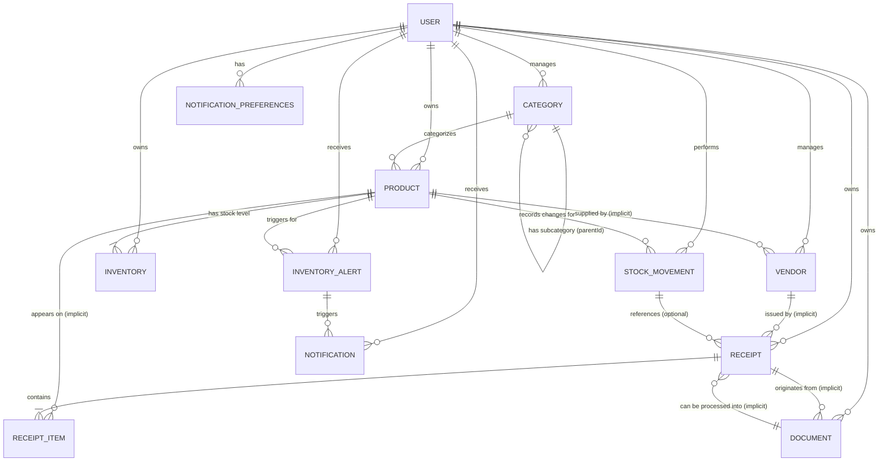

# Step 5: Data Models and Services Analysis

This document analyzes the data models and service layer implementation for the Receipt Scanner application, focusing on data structure, relationships, business logic organization, and service interactions.

## 1. Server-Side Data Models (`server/src/models/`)

### 1.1 `Category.js`

*   **Firestore Collection:** `categories`
*   **Data Structure:**
    *   `id` (string, Firestore document ID)
    *   `name` (string, required)
    *   `userId` (string, required, links to User)
    *   `color` (string, hex color, default: '#000000')
    *   `budget` (number, default: 0)
    *   `createdAt` (Date, default: current date)
    *   *(Implicitly)* `parentId` (string | null, used in `CategoryManagementService` but not explicitly in model constructor/toJSON) - Represents subcategory relationship.
*   **Relationships:**
    *   Belongs to a `User` (`userId`).
    *   Can have a parent `Category` (`parentId` - managed in service).
    *   Can be associated with `Product` (managed in service).
*   **Validation:** Basic validation (required fields) seems implied by usage, but no explicit `validate()` method in the model itself. Service layer (`CategoryManagementService`) checks for existing names.
*   **Defaults:** `color` ('#000000'), `budget` (0), `createdAt` (current date).
*   **Firestore Mapping:**
    *   `save()`: Creates or updates document in `categories` collection using `set({ merge: true })`. Assigns `id` if new.
    *   `findByUserId()`: Static method to query categories by `userId`.
    *   `toJSON()`: Returns object with core fields for saving.

### 1.2 `Document.js`

*   **Firestore Collection:** `documents`
*   **Data Structure:**
    *   `id` (string, Firestore document ID)
    *   `userId` (string, required)
    *   `type` (string, e.g., 'receipt', 'invoice', 'unknown', default: 'unknown')
    *   `source` (string, e.g., 'upload', 'scan', default: null)
    *   `metadata` (object, default: {}) - Stores arbitrary metadata.
    *   `extractedText` (string, default: '')
    *   `processedData` (object, default: {}) - Stores data extracted based on `type`.
    *   `tags` (array of strings, default: [])
    *   `confidence` (number, OCR confidence, default: 0)
    *   `status` (string, 'pending', 'processed', 'error', default: 'pending')
    *   `fileUrl` (string, URL to stored file, default: null)
    *   `createdAt` (string, ISO date, default: current date)
    *   `processedAt` (string | null, ISO date, default: null)
*   **Relationships:**
    *   Belongs to a `User` (`userId`).
    *   Potentially linked to a `Receipt` or other specific document types via `processedData`.
*   **Validation:** No explicit `validate()` method. Defaults handle missing optional fields. Status transitions managed by methods.
*   **Defaults:** `type` ('unknown'), `source` (null), `metadata` ({}), `extractedText` (''), `processedData` ({}), `tags` ([]), `confidence` (0), `status` ('pending'), `fileUrl` (null), `createdAt` (current date), `processedAt` (null).
*   **Firestore Mapping:**
    *   `save()`: Creates or updates document. Sets `id` and `processedAt`.
    *   `findByUserId()`: Static method to query documents by `userId` with optional `type` and `status` filters.
    *   `toJSON()`: Returns object with core fields.
*   **Methods:** `addTags()`, `updateProcessingStatus()`.

### 1.3 `Inventory.js`

*   **Firestore Collection:** `inventory`
*   **Data Structure:**
    *   `id` (string, Firestore document ID)
    *   `userId` (string, required)
    *   `productId` (string, required, links to Product)
    *   `quantity` (number, default: 0)
    *   `unit` (string, default: 'piece')
    *   `location` (string, default: 'default')
    *   `reorderPoint` (number, default: 0)
    *   `maxStock` (number | null, default: null)
    *   `lastStockUpdate` (string, ISO date, default: current date)
    *   `status` (string, calculated: 'out_of_stock', 'low_stock', 'in_stock', 'overstocked')
    *   `batchInfo` (object, default: {}) - For batch tracking.
    *   `createdAt` (string, ISO date, default: current date)
    *   `updatedAt` (string, ISO date, set on save)
*   **Relationships:**
    *   Belongs to a `User` (`userId`).
    *   Represents stock for a specific `Product` (`productId`).
*   **Validation:** No explicit `validate()` method. Status is calculated. `updateQuantity` ensures quantity doesn't go below zero implicitly via service logic.
*   **Defaults:** `quantity` (0), `unit` ('piece'), `location` ('default'), `reorderPoint` (0), `maxStock` (null), `lastStockUpdate` (current date), `batchInfo` ({}), `createdAt` (current date).
*   **Firestore Mapping:**
    *   `save()`: Creates or updates document. Sets `id`, calculates `status`, sets `updatedAt`.
    *   `findByUserId()`: Static method to query inventory by `userId` with optional `status` and `productId` filters.
    *   `toJSON()`: Returns object with core fields.
*   **Methods:** `calculateStatus()`, `updateQuantity()`, `setReorderPoint()`.

### 1.4 `InventoryAlert.js`

*   **Firestore Collection:** `alerts` (Note: Also used by `alertService` for general alerts)
*   **Data Structure:**
    *   `id` (string, Firestore document ID)
    *   `userId` (string, required)
    *   `productId` (string, required, links to Product)
    *   `type` (string, required, e.g., 'low_stock', 'reorder', 'expiry', 'price_change')
    *   `message` (string, required)
    *   `level` (string, required, 'info', 'warning', 'alert', 'critical')
    *   `status` (string, 'new', 'read', 'resolved', 'dismissed', default: 'new')
    *   `suggestedAction` (string, optional)
    *   `actionData` (object, default: {}) - Stores resolution/dismissal notes.
    *   `createdAt` (Date, default: current date)
    *   `resolvedAt` (Date | null)
    *   `resolvedBy` (string | null, links to User ID)
    *   `metadata` (object) - Stores context like `currentStock`, `threshold`.
*   **Relationships:**
    *   Belongs to a `User` (`userId`).
    *   Associated with a `Product` (`productId`).
*   **Validation:** `validate()` method checks required fields and enum values (`level`, `status`).
*   **Defaults:** `status` ('new'), `actionData` ({}), `createdAt` (current date).
*   **Firestore Mapping:**
    *   `save()`: Creates or updates document. Sets `id`. Calls `validate()`.
    *   `findActiveAlerts()`, `findByProduct()`, `findCriticalAlerts()`: Static methods for querying alerts.
    *   `toJSON()`: Returns object with core fields.
*   **Methods:** `resolve()`, `dismiss()`, `validate()`.

### 1.5 `Product.js`

*   **Firestore Collection:** `products`
*   **Data Structure:**
    *   `id` (string, Firestore document ID)
    *   `userId` (string, required)
    *   `name` (string, required)
    *   `category` (string, required, likely links to Category ID)
    *   `description` (string, default: '')
    *   `sku` (string, optional)
    *   `barcode` (string, optional)
    *   `currentStock` (number, default: 0)
    *   `unit` (string, default: 'pc')
    *   `unitPrice` (number, required)
    *   `minStockLevel` (number, default: 0)
    *   `maxStockLevel` (number | null, optional)
    *   `reorderPoint` (number | null, optional)
    *   `reorderQuantity` (number | null, optional)
    *   `vendors` (array of strings/objects, default: []) - Likely Vendor IDs or simple names.
    *   `location` (string, optional)
    *   `tags` (array of strings, default: [])
    *   `status` (string, 'active', 'inactive', etc., default: 'active')
    *   `priceHistory` (array of objects, default: []) - Stores `{ date, oldPrice, newPrice, reason }`.
    *   `metadata` (object) - Stores `createdAt`, `lastModified`, `lastStockUpdate`, `lastPriceUpdate`.
*   **Relationships:**
    *   Belongs to a `User` (`userId`).
    *   Belongs to a `Category` (`category`).
    *   Associated with `Vendor`s (`vendors`).
    *   Has `Inventory` records (implicitly, linked via `productId`).
    *   Has `StockMovement` records (linked via `productId`).
    *   Can trigger `InventoryAlert`s.
*   **Validation:** `validate()` method checks required fields and basic constraints (non-negative stock/price).
*   **Defaults:** `description` (''), `currentStock` (0), `unit` ('pc'), `minStockLevel` (0), `vendors` ([]), `tags` ([]), `status` ('active'), `priceHistory` ([]), `metadata.createdAt`/`lastModified` (current date).
*   **Firestore Mapping:**
    *   `save()`: Creates or updates document. Sets `id`, `metadata.lastModified`. Calls `validate()`.
    *   `findById()`, `findByBarcode()`, `findByUser()`: Static methods for querying products.
    *   `toJSON()`: Returns object with core fields.
*   **Methods:** `updateStock()`, `updatePrice()`, `checkStockAlerts()`, `validate()`.

### 1.6 `Receipt.js`

*   **Firestore Collection:** `receipts`
*   **Data Structure:**
    *   `id` (string, Firestore document ID)
    *   `userId` (string, required)
    *   `documentType` (string, default: 'receipt')
    *   `vendor` (string, required)
    *   `date` (Date, required)
    *   `total` (number, required)
    *   `subtotal` (number | null)
    *   `tax` (number | null)
    *   `category` (string | null) - Overall receipt category.
    *   `items` (array of objects, default: []) - Stores `{ name, quantity, price, total, category, unitPrice }`.
    *   `imageUrl` (string | null) - Link to stored image.
    *   `originalText` (string | null) - Full text from OCR.
    *   `confidence` (number | null) - OCR confidence.
    *   `status` (string, default: 'active')
    *   `notes` (string, default: '')
    *   `metadata` (object) - Stores `createdAt`, `lastModified`, `originalFileName`, `processedAt`, `textLayout`, `processingDetails`.
    *   `paymentMethod` (string | null)
    *   `location` (object | null) - Geolocation data.
*   **Relationships:**
    *   Belongs to a `User` (`userId`).
    *   Associated with a `Vendor` (implicitly via `vendor` name).
    *   Items might relate to `Product`s (though not explicitly linked by ID here).
    *   Items have categories, potentially linking to `Category`.
*   **Validation:** `validate()` method checks required fields and item structure/types.
*   **Defaults:** `documentType` ('receipt'), `items` ([]), `status` ('active'), `notes` (''), `metadata.createdAt`/`lastModified` (current date), `metadata.textLayout`/`processingDetails` ({}).
*   **Firestore Mapping:**
    *   `save()`: Creates or updates document. Sets `id`, `metadata.lastModified`.
    *   `remove()`: Deletes document.
    *   `findById()`, `find()`, `countDocuments()`: Static methods for querying receipts with filtering and pagination support.
    *   `toJSON()`: Returns object with core fields, formatting item data.
*   **Methods:** `validate()`.

### 1.7 `StockMovement.js`

*   **Firestore Collection:** `stockMovements`
*   **Data Structure:**
    *   `id` (string, Firestore document ID)
    *   `userId` (string, required)
    *   `productId` (string, required, links to Product)
    *   `type` (string, required, 'add', 'subtract', 'adjust', 'transfer')
    *   `quantity` (number, required, positive)
    *   `previousStock` (number, required)
    *   `newStock` (number, required, non-negative)
    *   `reason` (string, default: '')
    *   `reference` (string | null) - e.g., Receipt ID, Order ID.
    *   `date` (Date, default: current date)
    *   `location` (string | null)
    *   `cost` (number | null)
    *   `notes` (string, default: '')
    *   `metadata` (object) - Stores `createdAt`, `createdBy`, `documentType`, `documentId`.
*   **Relationships:**
    *   Belongs to a `User` (`userId`).
    *   Associated with a `Product` (`productId`).
    *   Can be linked to a `Receipt` or other document via `reference` or `metadata`.
*   **Validation:** `validate()` method checks required fields, enum values (`type`), and constraints (positive quantity, non-negative stock).
*   **Defaults:** `reason` (''), `reference` (null), `date` (current date), `notes` (''), `metadata.createdAt` (current date).
*   **Firestore Mapping:**
    *   `save()`: Creates or updates document. Sets `id`. Calls `validate()`.
    *   `findByProduct()`, `findByDateRange()`: Static methods for querying movements.
    *   `toJSON()`: Returns object with core fields.
*   **Methods:** `validate()`.

### 1.8 `User.js`

*   **Firestore Collection:** `users`
*   **Data Structure:**
    *   `id` (string, required, Firebase Auth UID)
    *   `email` (string, required)
    *   `name` (string | null)
    *   `preferences` (object, default: {}) - User-specific settings.
    *   `createdAt` (Date, default: current date)
    *   `updatedAt` (Date, set on save/update)
    *   `active` (boolean, default: true)
    *   `lastLoginAt` (Date | null, default: null)
*   **Relationships:**
    *   Primary entity, linked to almost all other models via `userId`.
*   **Validation:** `validate()` method checks required fields (`id`, `email`) and basic formats (email). Validation also occurs in the constructor.
*   **Defaults:** `preferences` ({}), `createdAt` (current date), `active` (true), `lastLoginAt` (null).
*   **Firestore Mapping:**
    *   `save()`: Creates or updates document. Sets `updatedAt`. Calls `validate()`.
    *   `findById()`, `findByEmail()`: Static methods for querying users.
    *   `toJSON()`: Returns object with core fields for saving (excludes `id`).
*   **Methods:** `update()`, `delete()`, `updateLoginTimestamp()`, `validate()`.

### 1.9 `Vendor.js`

*   **Firestore Collection:** `vendors`
*   **Data Structure:**
    *   `id` (string, Firestore document ID)
    *   `name` (string, required)
    *   `userId` (string, required)
    *   `address` (string | null, default: null)
    *   `contactInfo` (object, default: {}) - e.g., phone, email.
    *   `tags` (array of strings, default: [])
    *   `productCategories` (array of strings, default: []) - Categories this vendor supplies.
    *   `performanceMetrics` (object) - Stores `averagePrice`, `totalPurchases`, `lastPurchaseDate`. Defaults to 0/null.
    *   `createdAt` (string, ISO date, default: current date)
    *   `updatedAt` (string, ISO date, set on save)
*   **Relationships:**
    *   Belongs to a `User` (`userId`).
    *   Associated with `Product`s (implicitly via `Product.vendors` array).
    *   Associated with `Receipt`s (implicitly via `Receipt.vendor` name).
*   **Validation:** No explicit `validate()` method. Required fields (`name`, `userId`) enforced by usage.
*   **Defaults:** `address` (null), `contactInfo` ({}), `tags` ([]), `productCategories` ([]), `performanceMetrics` (defaults 0/null), `createdAt` (current date).
*   **Firestore Mapping:**
    *   `save()`: Creates or updates document. Sets `id`, `updatedAt`.
    *   `findByUserId()`: Static method to query vendors by `userId`.
    *   `toJSON()`: Returns object with core fields.
*   **Methods:** `updatePerformanceMetrics()`.

## 2. Client-Side Type Definitions (`client/src/core/types/`, `client/src/features/auth/types/`)

*   **`api.ts`:** Defines generic API response structures (`ApiResponse`, `PaginatedResponse`) and some specific data shapes (`DocumentUploadResponse`, `InventoryItem`, `StockMovement`, `AnalyticsData`, `AlertSettings`). These often mirror server-side models but might be simplified or structured differently for frontend use.
    *   `InventoryItem`: Simpler than server `Product` + `Inventory`.
    *   `StockMovement`: Simpler than server `StockMovement`.
*   **`authTypes.ts` (core):** Defines `User` (simpler than server `User`, includes `role`, `profileImage`), `AuthState`, `LoginCredentials`, `RegistrationData`. These are specific to the client's auth state management.
*   **`common.ts`:** Defines common data shapes used across features: `DocumentItem` (similar to `Receipt.items` sub-document), `Receipt` (client-side version, simpler than server model), `InventoryFilter`, `DateRange`, `BudgetCategory`, `UserSettings`.
*   **`authTypes.ts` (features/auth):** More detailed auth-related types: `UserProfile`, `LoginCredentials`, `RegisterData`, `User` (includes token), `AuthState`, `PasswordResetRequest`, `AuthMethod`, `AuthService` interface, `AuthErrorType` enum, `AuthError` class, `OAuthProviderConfig`, `AuthPreferences`. This file provides a comprehensive definition for the client's authentication feature.
*   **Consistency:** There's reasonable overlap between client types and server models (e.g., User, Receipt items), but client types are often simplified or tailored for specific UI needs. Some client types don't have direct server model equivalents (e.g., `AuthState`, `AnalyticsData`). Maintaining consistency requires careful mapping in API service layers.

## 3. Server-Side Service Layer Analysis (`server/src/services/`)

### General Observations:

*   **Structure:** Services are organized into subdirectories based on domain (alert, analytics, auth, category, document, inventory, notification, receipts, report, validation). Most services are implemented as classes, often exported as singletons (`new ServiceName()`).
*   **Responsibilities:** Each service generally encapsulates business logic related to its domain, interacting with corresponding models and sometimes other services or external APIs.
*   **Model Interaction:** Services frequently use static methods (`find...`) and instance methods (`save`, `update...`) of the models to interact with Firestore.
*   **Error Handling:** Consistent use of `try...catch` blocks, logging errors with `logger`, and throwing/propagating `AppError` for controlled error responses.
*   **External Integrations:**
    *   **Firebase Firestore (`db`):** Used by almost all services for data persistence.
    *   **Firebase Auth (`auth`, `admin.auth()`):** Used by `AuthenticationService`.
    *   **Firebase Storage (`storage`):** Used by `DocumentProcessingService`, `visionService`, `ReceiptProcessingService`.
    *   **Google Cloud Vision API (`@google-cloud/vision`):** Used by `DocumentProcessingService`, `visionService`, `ReceiptProcessingService`.
    *   **SendGrid (`@sendgrid/mail`):** Used by `NotificationService` (optional, based on API key presence).
    *   **Firebase Cloud Messaging (FCM) (`admin.messaging()`):** Used by `NotificationService`.
    *   **Sharp (`sharp`):** Used by `preprocessing.js` and `DocumentProcessingService` for image manipulation.
    *   **Lodash (`_`):** Used by `AnalyticsService` for data manipulation.
    *   **Express-validator:** Used by `ValidationService`.
*   **Performance:**
    *   `AnalyticsService` implements basic in-memory caching.
    *   Database transactions (`db.runTransaction`) are used in `InventoryManagementService` and `CategoryManagementService` for atomic operations.
    *   Use of `async/await` for non-blocking operations.

### Specific Service Details:

*   **`preprocessing.js`:** Handles advanced image preprocessing using `sharp` (noise reduction, rotation, color optimization, quality adjustment).
*   **`alert/alertService.js`:** Manages alert lifecycle (creation, processing, resolution). Defines alert types/priorities. Integrates with `NotificationService` to send alerts based on preferences and priority. Includes logic for alert escalation (though `admin` reference seems missing for `FieldValue.arrayUnion`).
*   **`analytics/analyticsService.js`:** Performs complex data analysis for prices, spending, inventory, and vendors. Retrieves data from Firestore, performs calculations (statistics, trends, predictions, regression, volatility), aggregates data, and implements caching. Relies heavily on Lodash.
*   **`auth/AuthenticationService.js`:** Handles user registration (creating Firebase Auth user and Firestore doc), login (generating custom token, updating timestamp), token verification, profile/preference updates, and password reset initiation. Defines default user preferences.
*   **`category/CategoryManagementService.js`:** Manages category CRUD operations. Handles parent/child relationships. Prevents deletion if subcategories exist. Moves products to 'uncategorized' on deletion. Can initialize default categories for new users.
*   **`document/DocumentProcessingService.js`:** Orchestrates the main document processing pipeline: image optimization (`preprocessing.js`, `sharp`), text extraction (`visionClient`), document classification (`_classifyDocumentType`, `documentClassifier.js` logic embedded), type-specific processing (receipt/invoice parsing - delegates to `ReceiptProcessingService`), and image upload (`_uploadImage`). Contains detailed logic for text block processing, layout analysis, and metadata extraction.
*   **`document/visionService.js`:** Simple wrapper around Google Cloud Vision API for text detection and Firebase Storage for image upload. Seems partially redundant with `DocumentProcessingService`.
*   **`inventory/InventoryManagementService.js`:** Manages stock updates using transactions. Calculates stock metrics, checks stock levels against thresholds, creates alerts (using `_createAlerts`), and triggers notifications (`NotificationService`). Handles stock transfers and adjustments. Integrates with `AnalyticsService`.
*   **`inventory/stockTrackingService.js`:** Seems to duplicate some logic from `InventoryManagementService` (tracking movements, updating stock, checking levels). Also includes stock audit functionality. The separation of responsibility between this and `InventoryManagementService` is unclear.
*   **`notification/NotificationService.js`:** Manages sending notifications via different channels (Email via SendGrid, Push via FCM). Fetches and manages user notification preferences stored in Firestore. Handles different notification types and priorities.
*   **`receipts/ReceiptProcessingService.js`:** Focuses specifically on parsing extracted text to identify receipt details (store, date, items, totals, payment method). Includes logic for categorizing items based on keywords. Also contains CRUD operations for receipts and analytics methods (summary, stats, search), potentially overlapping with `AnalyticsService`. Uses `visionClient` again for text extraction, duplicating `DocumentProcessingService`'s call.
*   **`report/reportService.js`:** Simple service to generate specific reports (currently just spending) by querying Firestore and aggregating data.
*   **`validation/Validation Service.js`:** Centralizes `express-validator` definitions for various models/operations. Provides reusable validation chains (pagination, date range, sorting) and helper methods. Includes a `validate` middleware function wrapper.

## 4. Utility Files with Business Logic

*   **`utils/document/documentClassifier.js`:** Implements logic to classify documents (receipt, invoice, warranty) based on keywords, regex patterns, and text structure analysis. Extracts vendor info and type-specific metadata. Assesses text quality and analyzes layout.
*   **`utils/misc/priceCalculator.js`:** Provides functions for calculating unit prices with unit conversions, extracting units from strings, standardizing units, comparing unit prices, calculating bulk discounts, and formatting prices.

## 5. Data Model Relationships (Conceptual)

**Description:**

*   The `USER` is the central entity.
*   Users manage `CATEGORY`s (which can be hierarchical) and `VENDOR`s.
*   Users own `PRODUCT`s, which belong to a `CATEGORY`.
*   `INVENTORY` tracks the stock level for each `PRODUCT` owned by a `USER`.
*   `STOCK_MOVEMENT` records changes to `INVENTORY` for a `PRODUCT`.
*   `RECEIPT`s and general `DOCUMENT`s are owned by a `USER`. Receipts contain items that implicitly relate to `PRODUCT`s and are issued by `VENDOR`s. Documents can be processed into Receipts.
*   `INVENTORY_ALERT`s are triggered for specific `PRODUCT`s based on `INVENTORY` levels and belong to a `USER`.
*   `NOTIFICATION_PREFERENCES` store user settings, and `NOTIFICATION`s are generated (often triggered by `INVENTORY_ALERT`s) and sent to users.

## 6. Service Layer Assessment

*   **Architecture:** Follows a service layer pattern, separating business logic from controllers and data access (mostly delegated to models). Services are generally domain-focused (Auth, Inventory, Analytics, etc.).
*   **Separation of Concerns:** Mostly good separation.
    *   Controllers handle HTTP requests/responses and call services.
    *   Services contain core business logic and orchestrate model interactions.
    *   Models handle direct Firestore interaction and data representation.
    *   Utilities handle specific, reusable tasks (classification, calculation).
*   **Areas for Improvement:**
    *   **Redundancy/Overlap:**
        *   `DocumentProcessingService`, `visionService`, and `ReceiptProcessingService` all seem capable of calling the Vision API for text extraction. This could be centralized.
        *   `InventoryManagementService` and `stockTrackingService` have overlapping responsibilities regarding stock updates and level checks. Their roles should be clarified or merged.
        *   `ReceiptProcessingService` includes CRUD and analytics methods that might belong better in the main `receiptController` (using models directly) or `AnalyticsService`.
    *   **Model Logic:** Some business logic resides within models (e.g., `Product.updateStock()`, `Product.checkStockAlerts()`). While convenient, complex logic might be better placed purely in the service layer for clearer separation, making models primarily data containers with persistence methods.
    *   **Dependency Injection:** Services are exported as singletons (`new Service()`). While simple, this makes testing harder and tightly couples services. Consider using dependency injection for better testability and flexibility.
    *   **Clarity:** The exact flow for document processing (which service calls which) could be clearer. `DocumentProcessingService` seems like the main orchestrator, but `ReceiptProcessingService` also has processing capabilities.

## 7. Business Logic Organization

*   **Core Logic:** Primarily located within the service classes (`*Service.js`).
*   **Data Validation:** Handled by `ValidationService` (using `express-validator`) and specific model `validate()` methods.
*   **Data Transformation/Calculation:** Found in services (`AnalyticsService`) and utilities (`priceCalculator.js`).
*   **External API Interaction:** Encapsulated within relevant services (`DocumentProcessingService`, `NotificationService`, `AuthenticationService`).
*   **Classification Logic:** Well-encapsulated in `DocumentClassifier.js`.

## 8. Recommendations

1.  **Refactor Service Responsibilities:**
    *   Clarify or merge the roles of `InventoryManagementService` and `stockTrackingService`. Prefer a single service for inventory logic.
    *   Centralize Vision API calls. `DocumentProcessingService` should likely be the sole entry point for OCR, potentially calling a leaner `visionService` utility if needed.
    *   Move CRUD and potentially analytics logic out of `ReceiptProcessingService` into controllers (using the `Receipt` model) or `AnalyticsService` respectively. Keep `ReceiptProcessingService` focused solely on *parsing* text into receipt data.
2.  **Consolidate Model Logic:** Move complex business logic (like stock updates triggering alerts in `Product.js`) into the corresponding service layer (`InventoryManagementService`) to keep models focused on data and persistence. Models can retain simple validation and helper methods.
3.  **Dependency Injection:** Implement dependency injection (e.g., passing service instances in constructors or using a DI container) instead of exporting singletons. This improves testability and reduces coupling.
4.  **Client/Server Type Consistency:** Establish a clearer strategy for sharing or mapping types between client and server to reduce duplication and potential inconsistencies. Consider using shared interfaces or code generation tools if applicable.
5.  **Model Validation:** Ensure all models have robust `validate()` methods or rely consistently on the `ValidationService` schemas before saving data to enforce data integrity at the model level. Add validation for `Vendor` and potentially enhance `Category` validation.
6.  **Refine `Document` Model:** Consider making the `Document` model more abstract or using inheritance/composition if different document types (`receipt`, `invoice`, etc.) require significantly different fields in `processedData`. Alternatively, ensure `processedData` schemas are well-defined.
7.  **Explicit Relationships:** While Firestore is NoSQL, consider storing explicit IDs where relationships are critical (e.g., storing `categoryId` in `Product`, `vendorId` in `Receipt` if vendors become managed entities) rather than relying solely on names (`Receipt.vendor`). This improves data integrity and query capabilities.
8.  **Error Handling Granularity:** While `AppError` is used well, ensure error codes/messages are specific enough to allow the frontend to react appropriately (e.g., distinguishing between 'not found' and 'server error').
