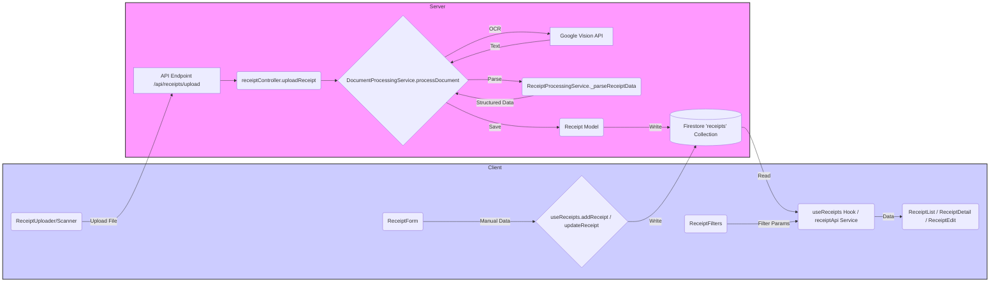

# Step 7: Receipt Management Analysis

This document analyzes the implementation of receipt management features, covering client-side UI/state management and server-side data handling, processing, and storage.

## 1. Client-Side Implementation (`client/src/features/receipts/`, `client/src/features/categories/`)

### 1.1 UI Components (`client/src/features/receipts/components/`)

*   **`ReceiptUploader.js`:** Uses `react-dropzone` for file uploads (JPG, PNG, HEIC). Includes validation (size, type), preview, and triggers an `onUploadSuccess` callback (likely initiating the server processing). Also includes a placeholder for camera integration.
*   **`ReceiptCard.js`:** Displays a summary of a single receipt (merchant, date, total, status, category, item count). Uses badges for status and tooltips for item lists. Handles selection state.
*   **`ReceiptList.js`:** Renders a list of `ReceiptCard` components. Implements pagination (`ITEMS_PER_PAGE = 10`) with page number display and previous/next buttons. Handles loading and error states for the receipt list.
*   **`ReceiptFilters.js`:** Provides UI controls (search input, dropdowns) for filtering receipts by merchant name (search text), date range, category (fetches options using `useCategories`), and sorting. Includes a "Clear Filters" button.
*   **`ReceiptDetail.js`:** Displays a full, detailed view of a selected receipt. Shows header info (merchant, date, category), actions (Print, Download), itemized list with quantities and prices, totals section (subtotal, tax, total), payment method, notes, and the receipt image (if available). Uses formatting utilities.
*   **`ReceiptForm.js`:** A form for *manual* creation or editing of receipts (likely used by `ReceiptEdit.js`). Includes fields for merchant, date, total, category (dropdown populated by `useCategories`), items (dynamic list with add/remove), and notes. Performs client-side validation (`validateReceipt`, `validateRequired`, `validateAmount`). Includes a check and modal confirmation if the manually entered total doesn't match the sum of item totals.
*   **`ReceiptEdit.js`:** (Content not read, but inferred) Likely wraps `ReceiptForm` to handle fetching existing receipt data (if editing) and passing the `onSave` and `onCancel` handlers.

### 1.2 Hooks (`client/src/features/receipts/hooks/`, `client/src/features/categories/hooks/`)

*   **`useReceipts.js`:**
    *   Manages the state for the list of receipts (`receipts`, `loading`, `error`).
    *   Fetches receipts **directly from Firestore** (`getDocs`, `collection`, `query`, `where`, `orderBy`) based on the logged-in user (`useAuth`) and applied filters (date range, category).
    *   Provides functions (`addReceipt`, `updateReceipt`, `deleteReceipt`) that perform CRUD operations **directly on Firestore**.
    *   Uses `useEffect` to fetch receipts when the user changes.
    *   **Note:** Direct Firestore access from the client hook bypasses any server-side API/logic for fetching/modifying receipts, which is a significant architectural concern.
*   **`useCategories.js`:** (Content not read, but inferred from usage in `ReceiptForm` and `ReceiptFilters`) Fetches the list of categories available to the user, likely also directly from Firestore or via a simple API call managed by `services/categories.js`. Used to populate category dropdowns.

### 1.3 Services (`client/src/features/receipts/services/`, `client/src/features/categories/services/`)

*   **`receipts.js (`receiptApi`)`:**
    *   Provides an API object for interacting with receipts.
    *   Functions (`createReceipt`, `getReceipts`, `getReceiptById`, `updateReceipt`, `deleteReceipt`) perform CRUD operations **directly on Firestore** (`addDoc`, `getDocs`, `getDoc`, `updateDoc`, `deleteDoc`) and Firebase Storage (`ref`, `uploadBytes`, `getDownloadURL`, `deleteObject`).
    *   Handles image upload/deletion associated with receipts during create/update/delete operations.
    *   Implements pagination logic (`startAfter`, `limit`) for `getReceipts`.
    *   **Note:** Similar to `useReceipts`, this service interacts directly with Firebase services from the client.
*   **`categories.js`:** (Content not read, but inferred) Likely contains functions to fetch category data, probably directly from Firestore, for use by the `useCategories` hook.

### 1.4 Utilities (`client/src/features/receipts/utils/`)

*   **`extra-formatters.js`:** Contains various formatting functions (currency, date, numbers, file size, etc.) used in the UI components.
*   **`validation.js`:** Provides client-side validation functions (`validateReceipt`, `validateFile`, `validateDateRange`, `validateCategory`, `validateForm`, etc.) used by components like `ReceiptForm`.

## 2. Server-Side Implementation (Relevant Files)

### 2.1 Controllers & Routes (`receiptController.js`, `receiptRoutes.js`)

*   Provides API endpoints for receipt operations:
    *   `/upload`, `/upload/bulk`: Handles image upload, triggers server-side processing (`DocumentProcessingService`).
    *   `/`: GET endpoint for fetching receipts with filtering and pagination (delegates to `Receipt.find` and `Receipt.countDocuments`). Includes inline validation middleware.
    *   `/:id`: GET, PUT, DELETE endpoints for specific receipts (delegates to `Receipt` model methods or `ReceiptProcessingService` for CRUD). Uses `validate` middleware.
    *   `/process-text`: Endpoint to process raw text (delegates to `DocumentProcessingService`).
    *   `/export`, `/categories/summary`, `/trends`, `/compare-prices`, `/similar`: Endpoints for analytics and other receipt-related actions, often delegating to `Receipt` model static methods or `ReceiptProcessingService`.

### 2.2 Services (`ReceiptProcessingService.js`, `CategoryManagementService.js`)

*   **`ReceiptProcessingService.js`:**
    *   Focuses heavily on *parsing* OCR text (`_parseReceiptData`) using regex to extract merchant, date, items, totals, payment method.
    *   Includes item categorization logic (`_categorizeItem`).
    *   Contains validation/cleaning logic (`_validateAndClean`).
    *   **Redundancy:** Also includes methods for OCR (`_extractText`), image upload (`_uploadImage`), database saving (`_saveToDatabase`), CRUD operations (`getReceipts`, `getReceiptById`, etc.), and analytics (`generateReceiptSummary`, `getReceiptStatistics`, `searchReceipts`). This overlaps significantly with `DocumentProcessingService`, `receiptController`, `Receipt` model, and potentially `AnalyticsService`.
*   **`CategoryManagementService.js`:** Handles CRUD for categories, including managing parent/child relationships and initializing default categories. Used implicitly when assigning categories to receipts or filtering by category.

### 2.3 Models (`Receipt.js`, `Category.js`)

*   **`Receipt.js`:**
    *   Defines the data structure stored in the `receipts` Firestore collection.
    *   Includes fields populated by OCR/parsing (`vendor`, `date`, `total`, `items`, `originalText`, `confidence`) and user input (`category`, `notes`).
    *   Provides static methods for querying (`findById`, `find`, `countDocuments`) with filtering/pagination.
    *   Provides instance methods for persistence (`save`, `remove`) and validation (`validate`).
*   **`Category.js`:** Defines the structure for categories, used for assigning to receipts and filtering.

## 3. Special Attention Points

*   **Receipt Structure Post-OCR:** The server (`ReceiptProcessingService` or `DocumentProcessingService`) parses the raw OCR text into a structured object matching the `Receipt` model schema (vendor, date, total, items array, etc.). This structured data is then saved to Firestore.
*   **Category Management:**
    *   Categories are managed via `CategoryManagementService` and stored in the `categories` collection.
    *   Receipts have a `category` field (string). Items within receipts also have a `category` field assigned during parsing (`_categorizeItem`).
    *   Client-side components (`ReceiptForm`, `ReceiptFilters`) use `useCategories` to fetch and display category options for assignment and filtering.
    *   Server-side fetching (`receiptController`, `Receipt.find`) allows filtering by the main receipt `category`. Filtering by *item* category within receipts seems less directly supported by the main query methods.
*   **Searching & Filtering:**
    *   **Client:** `ReceiptFilters` component provides UI for filtering by merchant (search text), date range, category, and sorting. The actual filtering logic seems to happen **client-side** within the `useReceipts` hook after fetching *all* receipts for the user (or a broad date range), or potentially **server-side** if the hook passes filters to the `receiptApi` service which then constructs the Firestore query. The current `useReceipts` implementation shows server-side filtering based on date and category passed to `fetchReceipts`. Search seems client-side. Sorting is also likely client-side unless passed to the API/Firestore query.
    *   **Server:** `receiptRoutes.js` GET `/` endpoint accepts query parameters for filtering (`startDate`, `endDate`, `category`, `vendor`, `minAmount`, `maxAmount`) and pagination (`page`, `limit`). These are used in `receiptController` to build Firestore queries via `Receipt.find`. Sorting (`sortBy`, `sortOrder`) is also supported in the query. `ReceiptProcessingService` also has a `searchReceipts` method with text search capabilities.
*   **Receipt Data Validation:**
    *   **Client:** `ReceiptForm` uses utility functions (`validateReceipt`, etc.) for immediate feedback during manual entry/editing. `ReceiptUploader` uses `validateFile`.
    *   **Server:** The `Receipt` model has a `validate()` method checking required fields and item structure. `receiptRoutes` uses `express-validator` (via `validate` middleware) for basic API input validation. `ReceiptProcessingService` has a `_validateAndClean` method applied after parsing.
*   **User Experience (Receipt Management):**
    *   **Listing:** Paginated list (`ReceiptList`) with card summaries (`ReceiptCard`) is standard. Filtering (`ReceiptFilters`) is available.
    *   **Viewing:** Detailed view (`ReceiptDetail`) shows parsed data and image.
    *   **Editing:** Manual editing form (`ReceiptForm`/`ReceiptEdit`) allows correcting OCR errors or adding receipts manually. Includes item management.
    *   **Uploading:** Dedicated uploader (`ReceiptUploader`) with drag-and-drop and preview.
    *   **Potential Issues:** Direct Firestore access from client hooks/services can lead to slower UI updates if not managed carefully (compared to optimistic updates with server APIs). Error handling for direct Firebase calls needs to be robust. The multiple client-side processing workflows identified in Step 6 could lead to inconsistent UX.

## 4. Receipt Data Flow (Post-OCR)

**Description:**

1.  **Upload:** Client (`ReceiptUploader`/`Scanner`) sends the image file to the server API (`/api/receipts/upload`).
2.  **Server Processing:** `receiptController` calls `DocumentProcessingService`. This service handles image optimization, calls Google Vision API for OCR, classifies the document, and uses `ReceiptProcessingService` (or internal logic) to parse the text into structured receipt data.
3.  **Server Storage:** The structured data is saved using the `Receipt` model to the Firestore `receipts` collection.
4.  **Client Fetching:** Client components (`ReceiptList`, `ReceiptDetail`, etc.) use the `useReceipts` hook or `receiptApi` service to fetch receipt data directly from Firestore.
5.  **Client Filtering/Display:** Filters applied via `ReceiptFilters` modify the Firestore query performed by `useReceipts`/`receiptApi`. Data is displayed using `ReceiptCard`, `ReceiptList`, `ReceiptDetail`.
6.  **Client Manual Edit/Create:** `ReceiptForm` allows manual data entry. On save, `useReceipts`/`receiptApi` writes the data directly to Firestore.

**Note:** The direct client-Firestore interaction (Steps 4 & 6) is a key architectural point identified.

## 5. Assessment and Recommendations

*   **Strengths:**
    *   Clear separation of concerns on the server between controllers, services (mostly), and models for receipt data.
    *   Dedicated client components for different aspects of receipt management (list, detail, form, filters, uploader).
    *   Server-side processing pipeline for OCR and parsing exists.
    *   Basic filtering and pagination are implemented on the server API and client hook/service.
*   **Weaknesses:**
    *   **Direct Client-Firebase Interaction:** `useReceipts` and `receiptApi` directly query and modify Firestore. This bypasses server-side validation (beyond basic model validation), business logic, and security rules defined at the API layer. It tightly couples the client to the database schema and can make implementing complex authorization or data manipulation difficult. It can also lead to performance issues if not carefully managed.
    *   **Service Redundancy:** `ReceiptProcessingService` has overlapping responsibilities with `DocumentProcessingService`, `receiptController`, and the `Receipt` model (CRUD, analytics).
    *   **Parsing Brittleness:** Reliance on regex for parsing can be fragile with varying receipt formats.
    *   **Client-Side Logic:** Some client services (`documentProcessingService`, `ocr`) contain logic (like DB writes or parsing) that should ideally reside on the server.
*   **Recommendations:**
    1.  **Refactor Client Data Access:** Modify `useReceipts` and `receiptApi` to interact with the **server API endpoints** (`/api/receipts`) instead of directly with Firestore. This centralizes data access, validation, and business logic on the server.
    2.  **Consolidate Server Services:** Refactor `ReceiptProcessingService`. Move its CRUD and analytics functions to the `receiptController` (using the `Receipt` model) or `AnalyticsService`. Keep it focused on *parsing* extracted text, potentially as a utility called by `DocumentProcessingService`.
    3.  **Improve Server Parsing:** Enhance server-side parsing logic (see Step 6 recommendations - use bounding boxes, structured OCR data, or specialized libraries).
    4.  **Server-Side Filtering/Sorting:** Ensure all filtering/sorting logic initiated by `ReceiptFilters` is handled efficiently by server-side Firestore queries rather than client-side filtering after fetching large datasets.
    5.  **Category Integration:** Ensure categories assigned to receipt *items* during parsing are utilized effectively, perhaps allowing filtering/reporting based on item categories, not just the overall receipt category. Consider storing `categoryId` instead of just the name string on receipts/items for better relational integrity.
    6.  **UX - Manual Entry:** While the `ReceiptForm` exists, ensure a smooth workflow for users to correct OCR errors or manually add receipts when scanning fails or isn't possible. The total mismatch check is a good feature.
