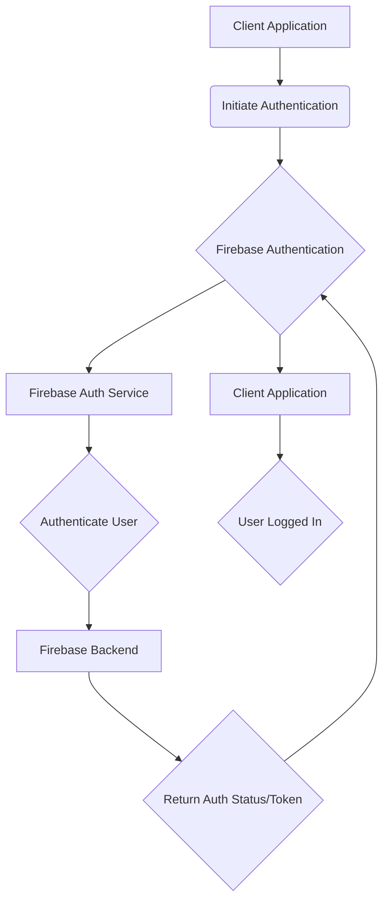
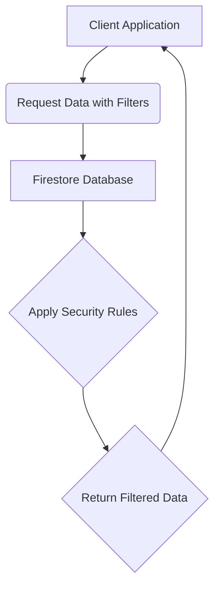

# Data Flow Diagrams

[Home](/docs) > [Core Documentation](/docs/core) > Data Flow Diagrams

## In This Document
- [User Authentication Flow](#user-authentication-flow)
- [Receipt Upload and Processing Flow](#receipt-upload-and-processing-flow)
- [Data Querying and Filtering Flow](#data-querying-and-filtering-flow)
- [Offline Operation Flow](#offline-operation-flow)
- [Future Considerations](#future-considerations)

## Related Documentation
- [Architecture Overview](../core/architecture.md)
- [Receipt Management Feature Documentation](../../features/receipts/overview.md)
- [Document Processing Feature Documentation](../../features/documents/overview.md)

This document provides data flow diagrams for key operations within the Receipt Scanner application, illustrating the interaction between client, server, and Firebase services.

## User Authentication Flow



## Receipt Upload and Processing Flow

```mermaid
graph TD
    A[Client Application] --> B(Select/Capture Receipt Image);
    B --> C(Upload to Firebase Storage);
    C --> D[Firebase Storage];
    D --> E{Trigger Cloud Function};
    E --> F[Firebase Cloud Function];
    F --> G(Call OCR Service);
    G --> H[External OCR Service];
    H --> I{Return OCR Results};
    I --> F;
    F --> J(Process OCR Data);
    J --> K(Save Data to Firestore);
    K --> L[Firestore Database];
    L --> M{Notify Client (Optional)};
    M --> A;
```

## Data Querying and Filtering Flow



## Offline Operation Flow

```mermaid
graph TD
    A[Client Application] --> B{Check Network Status};
    B -- Online --> C[Firebase Services];
    C --> D{Sync Data};
    D --> E[Local Cache (IndexedDB)];
    E --> A;
    B -- Offline --> E[Local Cache (IndexedDB)];
    E --> A{Access Cached Data};
```

## Future Considerations

[Planned or potential future enhancements to data flows or diagrams.]
