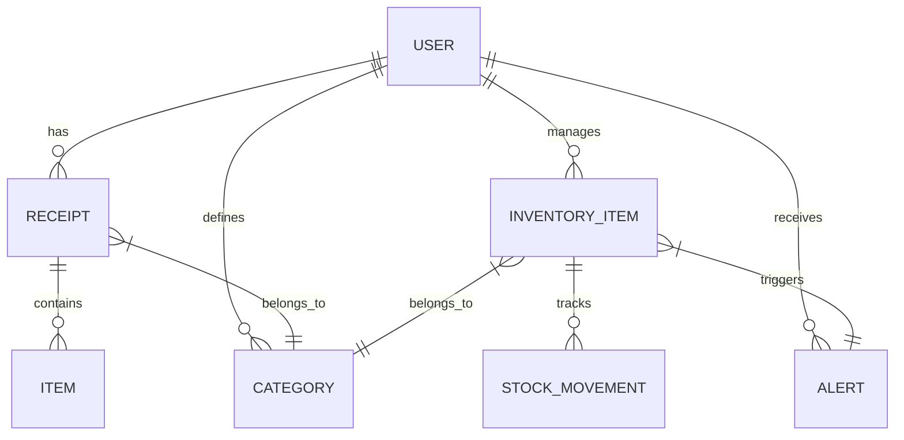

# Receipt Scanner Application Data Model

[Home](/docs) > [Core Documentation](/docs/core) > Receipt Scanner Application Data Model

## In This Document
- [Overview](#overview)
- [Entity Relationship Diagram](#entity-relationship-diagram)
- [Firestore Data Model Specification](#firestore-data-model-specification)
- [Field Types and Validation](#field-types-and-validation)
- [Indexing Strategy](#indexing-strategy)
- [Example Documents](#example-documents)
- [Relationships and Referencing](#relationships-and-referencing)
- [Future Considerations](#future-considerations)

## Related Documentation
- [Architecture Overview](../core/architecture.md)
- [Firestore Data Model (Firebase)](../firebase/firestore.md)
- [Receipt Storage Feature Documentation](../../features/receipts/storage.md)
- [Inventory Data Models Feature Documentation](../../features/inventory/data-models.md)
- [Document Storage Feature Documentation](../../features/documents/storage.md)

## Overview

This document provides a comprehensive description of the data model used in the Receipt Scanner application, focusing on the structure and relationships of data stored in Cloud Firestore.

## Entity Relationship Diagram

[Include a detailed entity relationship diagram (ERD) illustrating the main data entities and their relationships. Use Mermaid.js format.]

## Firestore Data Model Specification

### Collections and Documents

[Describe the main collections in Firestore and the types of documents they contain.]

### Document Structures and Fields

[For each major document type (e.g., User, Receipt, InventoryItem, StockMovement, Category, Alert), describe its structure, fields, data types, and purpose.]

#### User Document

[Describe User document fields]

#### Receipt Document

[Describe Receipt document fields]

#### Item Document (within Receipt)

[Describe Item document fields within a Receipt]

#### Inventory Item Document

[Describe Inventory Item document fields]

#### Stock Movement Document

[Describe Stock Movement document fields]

#### Category Document

[Describe Category document fields]

#### Alert Document

[Describe Alert document fields]

## Field Types and Validation

[Detail the data types used for various fields and any validation rules applied on the client-side or server-side (e.g., using Firestore security rules or backend validation).]

## Indexing Strategy

[Explain the indexing strategy in Firestore to optimize query performance.]

## Example Documents

[Provide JSON examples of typical documents for key collections.]

## Relationships and Referencing

[Explain how relationships between documents are managed (e.g., using document references).]

## Future Considerations

[Planned or potential future changes to the data model.]
