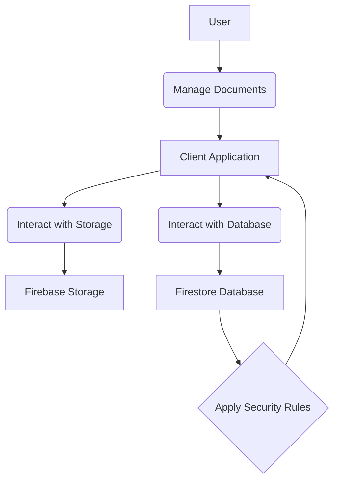

# Document Management Feature Overview

[Home](/docs) > [Features Documentation](/docs/features) > Document Management Feature Overview

## In This Document
- [Overview](#overview)
- [User-Facing Functionality](#user-facing-functionality)
- [Component Architecture](#component-architecture)
- [Data Models](#data-models)
- [Firebase Integration Points](#firebase-integration-points)
- [Error Handling](#error-handling)
- [Performance Considerations](#performance-considerations)
- [Testing Approach](#testing-approach)
- [Feature Overview Diagram](#feature-overview-diagram)
- [Future Considerations](#future-considerations)

## Related Documentation
- [Document Storage Details](./storage.md)
- [Document Lifecycle](./lifecycle.md)
- [Document Metadata](./metadata.md)

## Overview

This document provides a high-level overview of the Document Management feature in the Receipt Scanner application, covering how documents (including receipts) are stored, organized, and managed throughout their lifecycle.

## User-Facing Functionality

[Describe the user's interaction with the document management feature, including viewing, organizing, and potentially modifying documents. Include screenshots where helpful.]

## Component Architecture

[Describe the main components involved in this feature, including UI components, services, and any relevant backend or Cloud Functions.]

## Data Models

[Describe the data models used for documents and their associated metadata.]

## Firebase Integration Points

This feature integrates directly with Firebase services for document storage, processing, and management, controlled by a feature toggle (`documentsDirectIntegration`) with a fallback to the backend API.

- **Firebase Storage:** Used for storing the raw document image files. Documents are stored in a user-specific path (`documents/{userId}/{fileName}`).
- **Firestore Database:** Used for storing document metadata, including file name, upload date, document type, status, and processed results (extracted text, classification, confidence).
- **Firebase Cloud Functions (Assumed):** Document processing (OCR, classification) is triggered and handled by Firebase Cloud Functions or similar Firebase services. The client-side service interacts with these functions and retrieves results from Firestore.
- **Feature Toggle:** The `documentsDirectIntegration` feature flag in `client/src/core/config/featureFlags.js` controls whether the service uses direct Firebase SDK calls or falls back to the backend API for document processing operations.
- **API Fallback:** If the `documentsDirectIntegration` feature flag is disabled or a Firebase operation fails, the service falls back to using the original backend API endpoints for document processing.

## Error Handling

[Explain how errors are handled during document management operations.]

## Performance Considerations

[Discuss any performance aspects related to managing a large number of documents.]

## Testing Approach

[Describe the approach to testing this feature.]

## Feature Overview Diagram

## Future Considerations

[Planned or potential future enhancements to the document management feature.]
