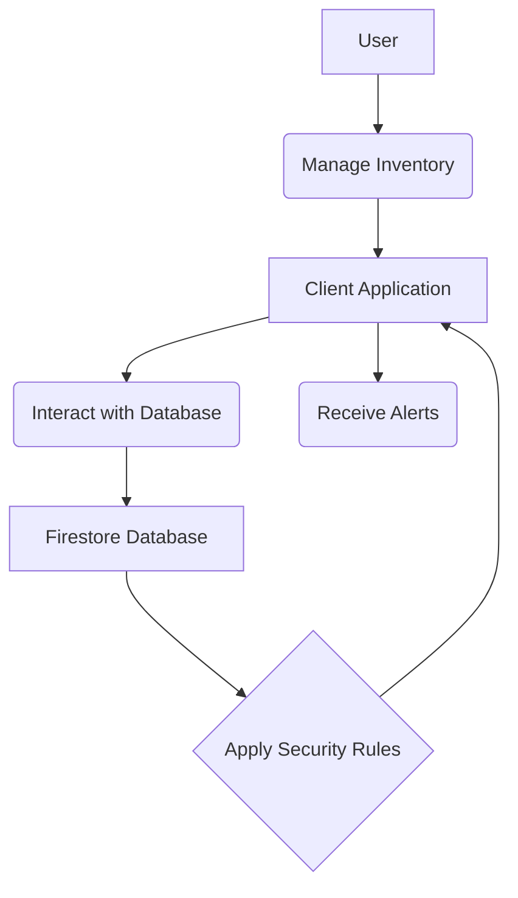

# Inventory Tracking Feature Overview

[Home](/docs) > [Features Documentation](/docs/features) > Inventory Tracking Feature Overview

## In This Document
- [Overview](#overview)
- [User-Facing Functionality](#user-facing-functionality)
- [Component Architecture](#component-architecture)
- [Data Models](#data-models)
- [Firebase Integration Points](#firebase-integration-points)
- [Error Handling](#error-handling)
- [Performance Considerations](#performance-considerations)
- [Testing Approach](#testing-approach)
- [Feature Overview Diagram](#feature-overview-diagram)
- [Future Considerations](#future-considerations)

## Related Documentation
- [Inventory Tracking Implementation](./implementation.md)
- [Inventory Data Models](./data-models.md)
- [Stock Management Details](./stock-management.md)

## Overview

This document provides a high-level overview of the Inventory Tracking feature in the Receipt Scanner application, covering how users can manage their inventory, track stock levels, and receive alerts.

## User-Facing Functionality

[Describe the user's interaction with the inventory tracking feature, including adding products, updating stock, viewing inventory lists, and managing alerts. Include screenshots where helpful.]

## Component Architecture

[Describe the main components involved in this feature, including UI components, services, and any relevant backend or Cloud Functions.]

## Data Models

[Describe the data models used for products, inventory items, stock movements, and alerts.]

## Firebase Integration Points

[Specify how this feature integrates with Firebase services, such as Firestore for storing inventory data.]

## Error Handling

[Explain how errors are handled during inventory management operations.]

## Performance Considerations

[Discuss any performance aspects related to managing a large inventory.]

## Testing Approach

[Describe the approach to testing this feature.]

## Feature Overview Diagram

## Future Considerations

[Planned or potential future enhancements to the inventory tracking feature.]
