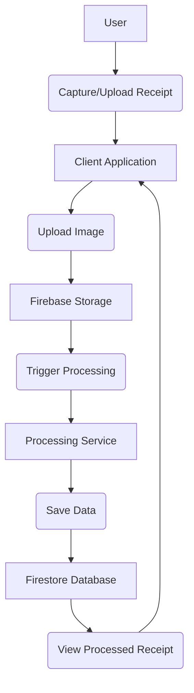

# Receipt Scanning and Processing Feature Overview

[Home](/docs) > [Features Documentation](/docs/features) > Receipt Scanning and Processing Feature Overview

## In This Document
- [Overview](#overview)
- [User-Facing Functionality](#user-facing-functionality)
- [Component Architecture](#component-architecture)
- [Data Models](#data-models)
- [Firebase Integration Points](#firebase-integration-points)
- [Error Handling](#error-handling)
- [Performance Considerations](#performance-considerations)
- [Testing Approach](#testing-approach)
- [Feature Overview Diagram](#feature-overview-diagram)
- [Future Considerations](#future-considerations)

## Related Documentation
- [Receipt Scanning Implementation](./scanning.md)
- [Receipt Processing Implementation](./processing.md)
- [Receipt Storage Details](./storage.md)
- [Receipt Search and Filter Details](./search-filter.md)

## Overview

This document provides a high-level overview of the Receipt Scanning and Processing feature in the Receipt Scanner application, covering the process from capturing a receipt image to extracting and managing the data.

## User-Facing Functionality

[Describe the user's interaction with the receipt scanning and processing feature, including steps for capturing, uploading, and viewing processed receipts. Include screenshots where helpful.]

## Component Architecture

[Describe the main components involved in this feature, including UI components, services, and any relevant backend or Cloud Functions.]

## Data Models

[Describe the data models used for receipts and related information.]

## Firebase Integration Points

[Specify how this feature integrates with Firebase services, such as Firebase Storage for image uploads and Firestore for storing receipt data.]

## Error Handling

[Explain how errors are handled during scanning, processing, and data saving.]

## Performance Considerations

[Discuss any performance aspects related to processing and displaying receipts.]

## Testing Approach

[Describe the approach to testing this feature.]

## Feature Overview Diagram

## Future Considerations

[Planned or potential future enhancements to the receipt scanning and processing feature.]
