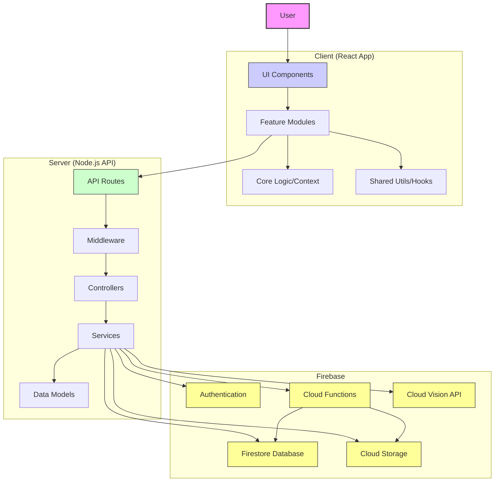

# Receipt Scanner Project Structure (Post-Cleanup)

This document outlines the current structure of the Receipt Scanner project after the initial cleanup phase.

## Root Directory

```
.
├── .firebaserc                 # Firebase project configuration
├── .gitignore                  # Git ignore rules
├── Backend Documentation.txt     # Server-side documentation (consider moving to /docs)
├── CONTRIBUTING.md             # Contribution guidelines
├── core-features-analysis.md   # Analysis document (consider moving to /docs or /extra)
├── extra/                      # Folder for archived/extra files
├── firebase.json               # Firebase hosting/functions deployment config
├── firestore.indexes.json      # Firestore index definitions
├── firestore.rules             # Firestore security rules
├── Frontend Development Requirements.txt # Client-side requirements (consider moving to /docs)
├── generateToken.js            # Script for token generation (utility)
├── LICENSE                     # Project license
├── postcss.config.js           # PostCSS configuration (client build)
├── project-map.md              # Project map (consider moving to /docs or /extra)
├── README.md                   # Main project README
├── storage.rules               # Firebase Storage security rules
├── tech-implementation-analysis.md # Analysis document (consider moving to /docs or /extra)
├── technical-documentation.md  # Main technical documentation
├── workplan-checklist.md       # Project planning checklist
├── claude chat/                # Folder for Claude chat logs (local only)
├── client/                     # Frontend React application
├── docs/                       # Project documentation
├── functions/                  # Firebase Cloud Functions
└── server/                     # Backend Node.js API server
```

## Client (`client/`)

Contains the React frontend application.

```
client/
├── .eslintrc.js                # ESLint configuration
├── .prettierrc                 # Prettier configuration
├── package.json                # Frontend dependencies and scripts
├── tailwind.config.js          # Tailwind CSS configuration
├── tsconfig.json               # TypeScript configuration (if applicable)
├── webpack.config.js           # Webpack configuration (if applicable)
├── public/                     # Static assets served directly
│   ├── index.html              # Main HTML entry point
│   └── ...
└── src/                        # Main source code
    ├── App.js                  # Root application component, sets up routing and context
    ├── index.js                # Application entry point, renders App
    ├── routes.js               # Defines application routes
    ├── core/                   # Core application logic, config, contexts
    │   ├── config/             # Application configuration (constants, etc.)
    │   ├── contexts/           # React Context providers (Auth, Toast)
    │   ├── pages/              # Core pages (NotFound)
    │   └── types/              # Core TypeScript types
    ├── features/               # Feature-specific modules
    │   ├── analytics/          # Analytics feature (dashboard, charts, reports)
    │   │   ├── components/     # UI components specific to analytics
    │   │   ├── hooks/          # Custom hooks for analytics data
    │   │   ├── pages/          # Page components for analytics routes
    │   │   └── services/       # API service interactions for analytics
    │   ├── auth/               # Authentication feature (login, register, etc.)
    │   │   ├── components/     # UI components for auth flows
    │   │   ├── hooks/          # Custom hooks for auth state
    │   │   └── types/          # TypeScript types for auth
    │   ├── categories/         # Category management feature (hooks likely here now)
    │   │   └── hooks/          # Custom hooks for category data (e.g., useCategories)
    │   ├── documents/          # Document handling (scanning, processing) - Some components moved to /extra
    │   │   ├── components/     # UI components for document handling (BaseDocumentHandler)
    │   │   └── hooks/          # Custom hooks for document scanning/OCR (useDocumentScanner, useOCR)
    │   ├── inventory/          # Inventory management feature
    │   │   ├── components/     # UI components for inventory
    │   │   ├── hooks/          # Custom hooks for inventory data
    │   │   └── services/       # API service interactions for inventory
    │   ├── receipts/           # Receipt management feature
    │   │   ├── components/     # UI components for receipts (list, card, detail, uploader)
    │   │   ├── hooks/          # Custom hooks for receipt data
    │   │   ├── pages/          # Page components for receipt routes
    │   │   └── services/       # API service interactions for receipts
    │   └── settings/           # User settings feature
    │       ├── components/     # UI components for settings sections
    │       ├── hooks/          # Custom hooks for settings data
    │       ├── pages/          # Page component for settings route
    │       └── services/       # API service interactions for settings
    ├── shared/                 # Shared components, hooks, utils across features
    │   ├── components/         # Reusable UI components (forms, layout, ui elements)
    │   ├── hooks/              # Reusable custom hooks (useToast, useLocalStorage)
    │   ├── services/           # Shared API service utilities (api.js, storage.js)
    │   ├── styles/             # Shared styling utilities
    │   └── utils/              # Shared utility functions (currency, date, fileHelpers, logger, validation)
    └── styles/                 # Global styles
        └── tailwind.css        # Tailwind CSS base styles and utilities
```

## Server (`server/`)

Contains the Node.js/Express backend API.

```
server/
├── package.json                # Backend dependencies and scripts
├── tsconfig.json               # TypeScript configuration (if applicable)
├── config/                     # Server configuration (Firebase, Multer, Vision API)
├── extra/                      # Archived/extra server files (documentClassifier, visionService)
├── src/                        # Main source code
│   ├── app.js                  # Express application setup and middleware
│   ├── controllers/            # Route handlers, interact with services
│   ├── middleware/             # Express middleware (auth, validation, upload)
│   ├── models/                 # Data models (representing Firestore collections)
│   ├── routes/                 # API route definitions
│   ├── scripts/                # Utility scripts (e.g., checkEnv)
│   ├── services/               # Business logic, interacts with Firebase/external APIs
│   └── utils/                  # Utility functions (logger, error handling)
└── tests/                      # Server-side tests
    ├── __mocks__/              # Test mocks
    └── fixtures/               # Test fixture data
```

## Functions (`functions/`)

Contains Firebase Cloud Functions code.

```
functions/
├── .eslintrc.js                # ESLint configuration
├── .gitignore                  # Git ignore rules
├── index.js                    # Main entry point for cloud functions
├── package.json                # Cloud functions dependencies and scripts
└── ...                         # Other function files if separated
```

## Docs (`docs/`)

Contains project documentation.

```
docs/
├── api.md                      # API documentation
└── architecture.md             # Architecture documentation
```

## High-Level Architecture



## Key File/Component Responsibilities

*   **`client/src/App.js`**: Root component, sets up routing and global context providers.
*   **`client/src/routes.js`**: Defines the mapping between URL paths and page components.
*   **`client/src/core/contexts/AuthContext.js`**: Manages global authentication state.
*   **`client/src/shared/components/layout/Layout.js`**: Provides the main application shell (navbar, sidebar, content area).
*   **`client/src/shared/utils/fileHelpers.js`**: Consolidated utility functions for file handling and validation.
*   **`client/src/shared/utils/validation.js`**: Consolidated utility functions for general input validation.
*   **`client/src/features/*/`**: Self-contained modules for specific application features.
*   **`server/src/app.js`**: Initializes the Express server, applies middleware, and mounts routes.
*   **`server/src/routes/*.js`**: Defines API endpoints for specific resources (e.g., `authRoutes.js`, `receiptRoutes.js`).
*   **`server/src/controllers/*.js`**: Handles incoming requests for specific routes, orchestrates service calls.
*   **`server/src/services/**/*.js`**: Contains the core business logic, interacts with Firebase services and external APIs.
*   **`server/src/middleware/auth/auth.js`**: Middleware for verifying user authentication tokens.
*   **`firestore.rules` / `storage.rules`**: Define security access rules for Firebase services.
*   **`functions/index.js`**: Entry point for Firebase Cloud Functions (e.g., background tasks, triggers).

This structure aims for modularity by separating concerns into core, shared, and feature-specific parts for the client, and a standard MVC-like pattern (Routes-Controllers-Services) for the server.
